# 数据分析学习

目前刚刚转入一个BI团队, 刚好又碰到公众号*木仓居士*(大家可以关注一下,数据仓库大牛^_^!)组织一块儿学习数据分析, 趁此机会好好补补数据分析相关的知识, 努力突破, 坚持下去!

## 数据的集中趋势

集中趋势又称"数据的中心位置","集中量数"等. 集中趋势的能够代表总体的某个特征的平均值.

常用的统计分析指标有众数, 中位数, 平均数, 分位数, 极差等, 下面详细了解一下这些指标表达的含义.

### 众数

众数(mode) 指一组数据中出现次数最多的数据值, 一组数据中的众数不止一个, 如 2, 4, 0, 9, 2, 4 中 2, 4都出现了两次, 它们都是这组数据的众数, 若所有数据出现的次数都一样, 那么这组数据没有众数.

### 中位数

中位数(Median), 代表一个样本,种群或机率分布中的一个数值, 可以将数值集合划分为相等的上下两部分. 对于有限集合, 可以将所有观察值顺序排列后找到中间的值作为中位数, 如果观察值有偶数个,则中位数不唯一, 通常去最中间两个数的平均数作为中位数.

设连续随机变量X的分布函数为F(X), 那么满足条件P(X<=m) = F(m) = 1/2 的数称为X或分布F的中位数.

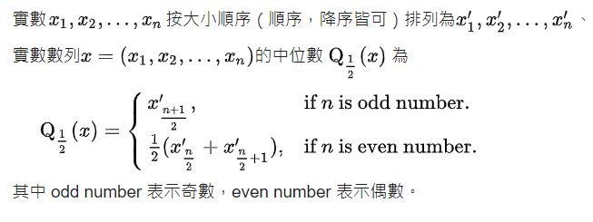

### 平均数

平均数(Mean) 目的是确定一组数据的均衡点, 表明观测值相对集中较多的中心位置.

平均数可以分为以下几个类型:

- 算数平均数(arthmetic mean)
    算数平均数是指在一组数据中所有数据之和再除以数据的个数.

    

- 几何平均数(geometric mean)
    几个观察值连城际的n次方根就是几何平均数.几何平均数分为加权和不加权之分.

    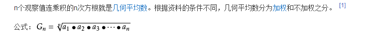

- 调和平均数(harmonic mean)
    调和平均数是平均数的一种. 但统计调和平均数, 与数学调和平均数不同. 在数学中调和平均数与算术平均数都是独立的自成体系的. 计算结果两者不相同且前者恒小于后者.

    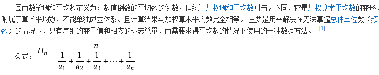

- 加权平均数(weighted average)
    加权平均数是不同比重数据的平均数, 加权平均数就是把原始数据按照合理的比例来计算.

    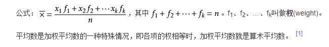

- 平方平均数
    平方平均数是n个数据的平方的算术平均数的算术平方根.

    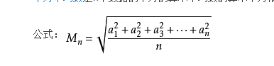

### 分位数

分位数(Quantile), 亦称分位点, 是指用分割点(cut point)将一个随机变量的范围的概率分布范围分位几个具有相同概率的连续区间.

---

## 数据的离中趋势

离中趋势又称"差异量数", "标志变动度"等. 指在数列中各个数值之间的差距和离散程度. 离中趋势的测定是对统计资料分散状况的测定, 即找出各个变量值与集中趋势的偏离程度.

离中趋势的主要指标有: 异众比率, 四分位差, 平均差, 标准差. 下面详细了解一下这个几个指标的含义.

### 数值型数据

数值型数据(metric data)是按数据尺度测量的观察值, 其结果表现为具体的数值.

#### 方差

方差又称变异数(Variance) 是在概率论和统计方差衡量随机变量或一组数据时离散程度的度量. 统计中的方差是每个样本值与全体样本值得平均数之差的平方值的平均数.

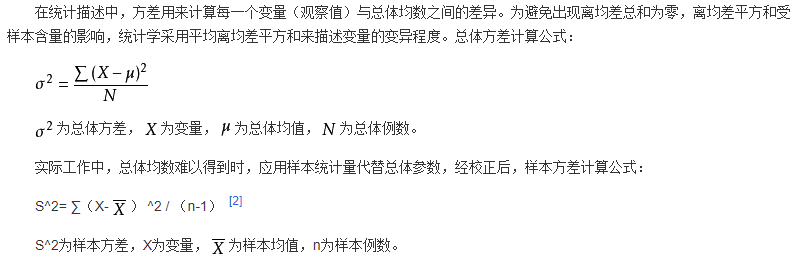

当数据分布比较分散(即数据在平均数附件波动较大)时, 各个数据与平均数的差的平方和较大, 方差就较大; 当数据分布比较集中式, 各个数据与平均数的差的平方和较小.

#### 标准差

标准差(又称标准偏差, 均方差, Standard Deviation, SD),符号σ(sigma), 是方差开主平方根, 反映组内个体的离散程度, 标准差与期望值之比为标准离差率.

离均差平方的平均; 方均根.

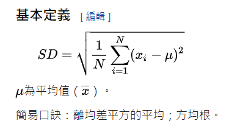

根号里面简易口诀: 平方和的平均 减去 平均的平方.

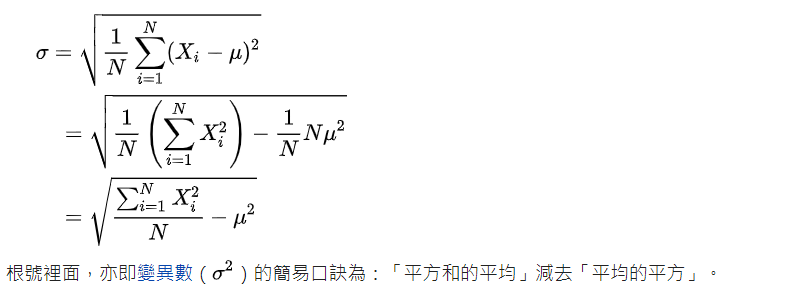

#### 极差

极差又称范围误差或全距(Range), 是用R来表示统计资料中的变异量数, 其最大值与最小值之间的差距.

公式为:
        R = Xmax - Xmin (其中, Xmax是最大值, Xmin是最小值)

#### 平均差

平均差(Mean Deviation)表示各个变量值之间差异程度的数值之一, 只各个变量值同平均数的离差绝对值得算术平均数.离差是总体各单位的标志值与算术平均数之差. 因离差和为零, 离差的平均数不能将离差和除以离差的个数求得, 而必须将离差取绝对数来消除正负号.

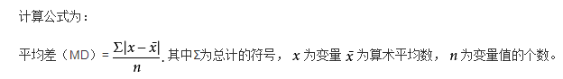

### 顺序数据

#### 四分位差

四分位数是将一组数据由小到大(或由大到小)排序后, 用3个点将全部数据分为4等分, 与这3个点位置上相对应得数值称为四分位数, 分别记为Q1(第一四分位数), 说明数据中有25%的数据小于或等于Q1, Q2(第二四分位数, 即中位数) 说明数据中有50%的数据小于或等于Q2, Q3(第三四分位数)说明数据中有75%的数据小于或等于Q3. 其中, Q3到Q1之间的距离的差的一半又称为分半四分位差, 记为（Q3-Q1）/2.

四分位差(quartile deviation), 它是上四分位数(Q3, 即位于75%) 与下四分位数(Q1, 即位于25%)的差.

### 分类数据

#### 异众比率

异众比率(variation ratio) 是指总体中非众数次数与全体次数之比, 也就是非主流数占总体的比例 ~_~.

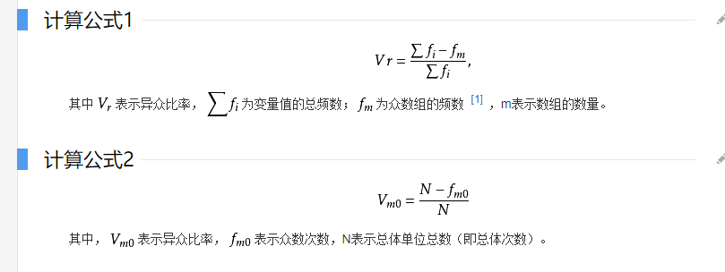

---

### 相对离散程度

#### 离散系数

相对离散指标也叫离散系数(variation coefficient), 变异系数或标准差系数等, 离散系数通常是就标准差来计算的, 因此, 也称为标准差系数, 它是一组数据的标准差与其相应的均值之比, 是测度数据离散程度的相对指标.

离散系数越大证明该组数据的离散程度也就越大, 反之则越小.

---

### 分布的形状

#### 偏态系数

偏态系数以平均值与中位数之差对标准差之比率来衡量偏斜的程度, 用SK表示偏斜系数:偏态系数小于0, 因为平均数在众数之左, 是一种左偏的分布, 又称为负偏.偏态系数大于0, 因为均值在众数之右, 是一种右偏的分布, 又称为正偏.

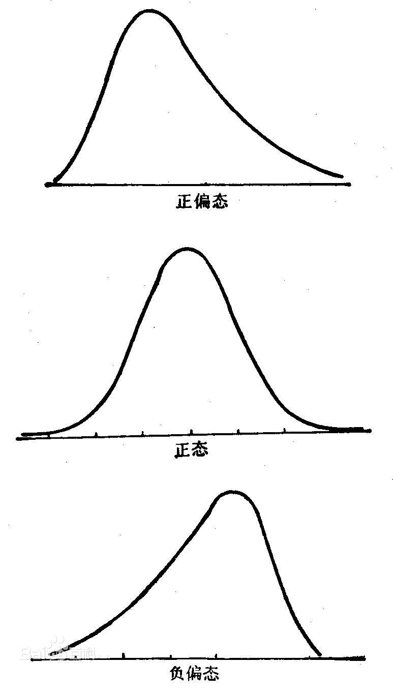

#### 峰态系数

峰度(peakedness;kurtosis)又称峰态系数. 表征概率密度分布曲线在平均值处峰值高低的特征数. 直观看来, 峰度反映了峰部的尖度. 样本的峰度是和正态分布相比较而言统计量, 如果峰度大于三, 峰的形状比较尖, 比正态分布峰要陡峭.反之亦然

峰度以bk表示, Xi是样本测定值, Xbar是样本n次测定值的平均值, s为样本标准差. 正态分布的峰度为3. 以一般而言, 正态分布为参照, 峰度可以描述分布形态的陡缓程度, 若bk<3, 则称分布具有不足的峰度, 若bk>3, 则称分布具有过度的峰度. 若知道分布有可能在峰度上偏离正态分布时, 可用峰度来检验分布的正态性

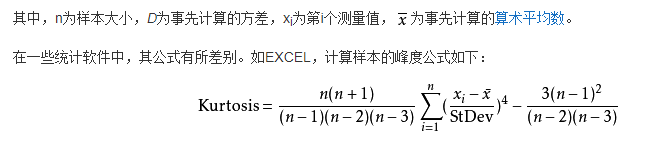

参考:

[集中趋势](https://baike.baidu.com/item/%E9%9B%86%E4%B8%AD%E8%B6%8B%E5%8A%BF/7179614)

[众数 wiki](https://zh.wikipedia.org/zh-hans/%E4%BC%97%E6%95%B0_%E6%95%B0%E5%AD%A6)

[众数 百科](https://baike.baidu.com/item/%E4%BC%97%E6%95%B0/44796)

[中位数 wiki](https://zh.wikipedia.org/wiki/%E4%B8%AD%E4%BD%8D%E6%95%B8)

[平均数 wiki](https://zh.wikipedia.org/zh-hans/%E5%B9%B3%E5%9D%87%E6%95%B0)

[平均数 百科](https://baike.baidu.com/item/%E5%B9%B3%E5%9D%87%E6%95%B0)

[分位数 wiki](https://zh.wikipedia.org/zh-hans/%E5%88%86%E4%BD%8D%E6%95%B0)

[离中趋势](https://baike.baidu.com/item/%E7%A6%BB%E4%B8%AD%E8%B6%8B%E5%8A%BF/22600321?noadapt=1)

[方差 wiki](https://zh.wikipedia.org/zh-hans/%E6%96%B9%E5%B7%AE)

[方差 百科](https://baike.baidu.com/item/%E6%96%B9%E5%B7%AE)

[标准差 wiki](https://zh.wikipedia.org/zh/%E6%A8%99%E6%BA%96%E5%B7%AE)

[极差 百科](https://baike.baidu.com/item/%E6%9E%81%E5%B7%AE)

[平均差 百科](https://baike.baidu.com/item/%E5%B9%B3%E5%9D%87%E5%B7%AE)

[四分位差 wiki](https://zh.wikipedia.org/wiki/%E5%9B%9B%E5%88%86%E4%BD%8D%E8%B7%9D)

[四分位差 百科](https://baike.baidu.com/item/%E5%9B%9B%E5%88%86%E4%BD%8D%E5%B7%AE)

[异众比率 百科](https://baike.baidu.com/item/%E5%BC%82%E4%BC%97%E6%AF%94%E7%8E%87)

[离散系数 百科](https://baike.baidu.com/item/%E7%9B%B8%E5%AF%B9%E7%A6%BB%E6%95%A3%E6%8C%87%E6%A0%87/18218588?noadapt=1)

[偏态系数 wiki](https://zh.wikipedia.org/wiki/%E5%81%8F%E5%BA%A6)

[偏态系数 百科](https://baike.baidu.com/item/%E5%81%8F%E6%80%81%E7%B3%BB%E6%95%B0)

[峰度 wiki](https://zh.wikipedia.org/wiki/%E5%B3%B0%E5%BA%A6)

[峰度 百科](https://baike.baidu.com/item/%E5%B3%B0%E5%BA%A6)

[数据分析思路](https://zhuanlan.zhihu.com/p/26936361)

[组内小伙伴整理的知识点](https://blog.csdn.net/loveyy1010/article/details/73198108)
